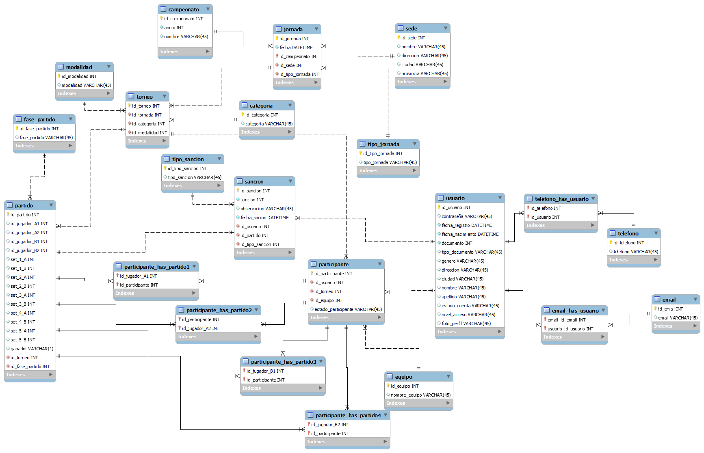

* [Inicio](../../README.md)  // [Atras](./torneo.md)
---
# Proyecto Final
## [Primer Entrega](https://docs.google.com/document/d/1eNhzoNRHFdaf4k3X3YFqG5KXV00cjXCEJprr76oM0Mo/edit?usp=drive_link)

# 1. Descripción de la Tematica

## Introducción

En el mundo del deporte, la organización y fiscalización adecuada son fundamentales para preservar la integridad de las competiciones y garantizar la transparencia en sus resultados. En este contexto, surge la necesidad de un sistema de gestión de base de datos eficiente y robusto.

El proyecto se centra en diseño e implementación de una base de datos, brindando una solución tecnológica para un ente fiscalizador de torneos de Ping Pong.

## Objetivo

El objetivo es desarrollar una base de datos que permita la gestión, creación y consulta de campeonatos y torneos por parte de un ente fiscalizador, y la creación de usuarios e inscripción a torneos del mismo.

## Descripción del proyecto

La base de datos se centra en **jornadas** y **usuarios** las cuales están interrelacionadas.

Las **jornadas** seran eventos únicos que se desarrollaran en una **sede** física el cual podrá sumar puntos o no para un **campeonato**. Y en dicha jornada se desarrollarán varios **torneos** de distintas **categorías** y **modalidades**.

Por cada **torneo** habrá un registro de los **partidos**, de estos datos se podrán extraer estadisticas.

Los **usuarios** tendrán sus datos personales almacenados, además, se les llamará **participantes** al inscribirse en uno o más **torneos** y podran formar **equipos** para la participación de los mismos.

Por último, habrá datos de **sanciones** que se le aplicara al **usuario** en caso de incumplimiento del reglamento.

# 2. Diagrama Entidad Relacion

# 3. Listado de Tablas

[link de tablas](https://docs.google.com/spreadsheets/d/1HAxpxAAihsEMrdb553Gdm2fKN-XI-f7RUpjKSsC85y0/edit?usp=sharing)

# 4. Archivo SQL

Este [Script](./archivos/script_ping_pong.sql) es utilizado para la creacion del esquema _ping_pong_ con las tablas descriptas anteriormente.

---

* [Inicio](../../README.md)  // [Atras](./torneo.md)

Por **_Juan Manuel Mascaró Iglesias_**